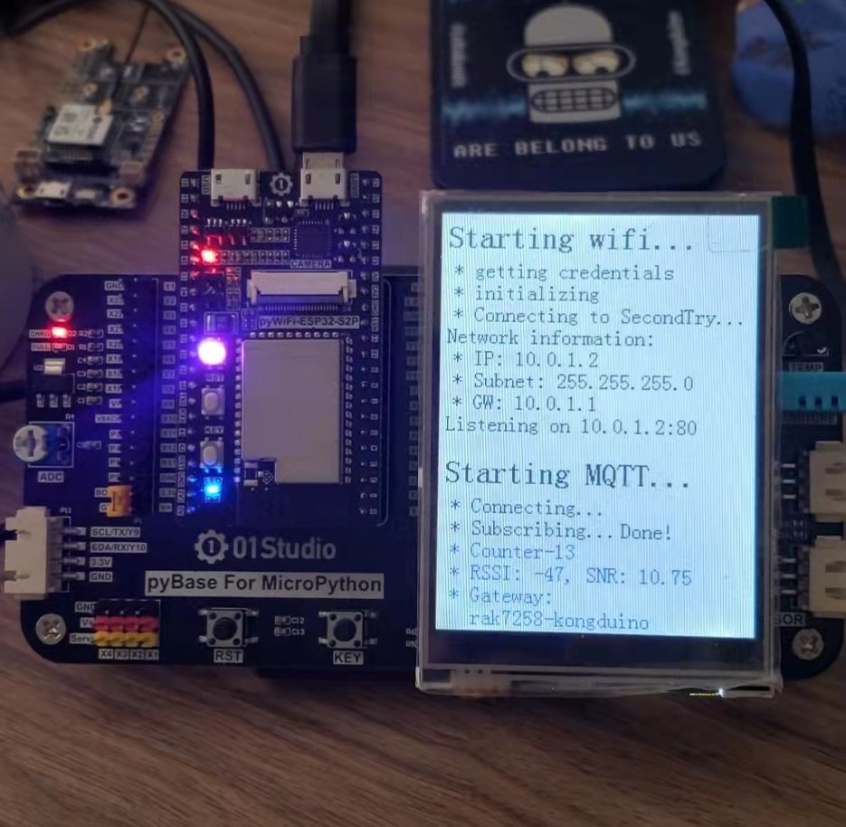

# TTN-MQTT Integration Test

This sample code, running on an ESP32-S2 with MicroPython ([this board](https://docs.01studio.cc/esp32-s2/quickref.html)), subscribes to a '#' topic on TTN, and parses incoming packets for the data sent by nodes. Since I have only one node sending stuff so far, I skipped the part that would identify the sender, but that isn't too hard to add – and when I add nodes I might have to.

Also, since I am sending dumb text, `Counter-\d+`, the payload is Base64-decoded and printed on Serial, the TFT, and saved in a static web page that's also served by the app. Three-in-one deal!

The code uses umqtt.simple2, which is added to the repository.

A `wifisecret.json` file is expected to be next to the code, with this structure:

```json
{
  "SSID":"ssid",
  "pwd":"pwd",
  "mqtt_user":"user",
  "mqtt_password":"pwd"
}
```

